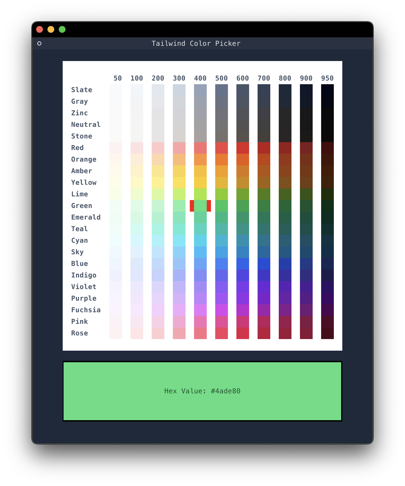

# Tailwind Color Picker

This tool displays the Tailwind color palette from which you can yank.



The yanked color is hex with hash i.e. `#f8fafc`

**Why?** I just like Tailwind colors and I like using them for things other than web development. This helps.

Colors are from the [Tailwind Documentation](https://tailwindcss.com/docs/customizing-colors
).

### Installation:

1. Clone this repository.
2. Run `pip install .`

### Usage:

Run with the command `twcp`.

Bindings, etc:

```
j / down   - move cursor down
k / up     - move cursor up
h / left   - move cursor left
l / right  - move cursor right
y / enter  - yank (copy) the select color
q / Ctrl+c - quit

Selecting a color with the mouse will copy it, if you mouse.
```
